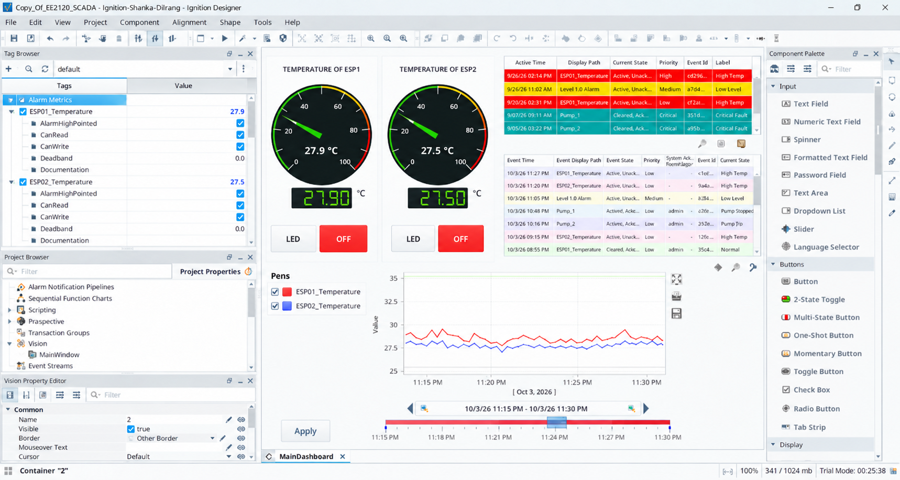
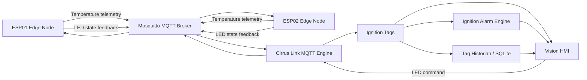

# MQTT-Based IIoT SCADA Monitoring and Control System

An industrial-style SCADA and IIoT prototype built with **Ignition Vision**, **Cirrus Link MQTT Engine**, **Eclipse Mosquitto**, **SQLite**, and **ESP8266 edge nodes**.

The system provides bidirectional communication between two ESP nodes and an Ignition SCADA dashboard for:

- live temperature monitoring
- historical trending
- High and Critical temperature alarming
- alarm status and alarm journal visualization
- remote LED control over MQTT
- device-state feedback to the SCADA interface

> **Status:** Educational / portfolio prototype. The architecture follows common SCADA and IIoT patterns, but the current implementation is not presented as production-ready.



## System Architecture



## Key Features

| Area | Implementation |
|---|---|
| Edge devices | Two ESP8266 nodes |
| Transport | MQTT over Wi-Fi |
| Broker | Eclipse Mosquitto |
| SCADA platform | Ignition 8.3 Vision |
| MQTT integration | Cirrus Link MQTT Engine |
| Process data | Simulated temperature telemetry |
| Clean tag layer | Ignition Expression Tags converted to Float |
| Historian | Ignition Tag Historian with SQLite |
| Alarming | High and Critical process alarms |
| Alarm history | Database-backed Alarm Journal |
| HMI | Gauges, digital displays, Easy Chart, Alarm Status Table, Alarm Journal Table |
| Control | Vision-to-ESP MQTT LED commands |
| Feedback | ESP-to-SCADA LED status feedback |

## Data Flow

### Telemetry

```text
ESP01 / ESP02
      ↓
MQTT telemetry topic
      ↓
Mosquitto
      ↓
Cirrus Link MQTT Engine
      ↓
Ignition MQTT tags
      ↓
[default] clean Float tags
      ↓
Historian + Alarming + Vision
```

### Control

```text
Vision control button
      ↓
MQTT Engine publish
      ↓
Mosquitto
      ↓
ESP command subscription
      ↓
Physical onboard LED
      ↓
LED status feedback topic
      ↓
Ignition
```

## MQTT Topic Model

| Node | Direction | Topic | Payload |
|---|---|---|---|
| ESP01 | ESP → SCADA | `EE2120/ESP01/temp` | Temperature as decimal text |
| ESP01 | SCADA → ESP | `EE2120/ESP01/LED/cmd` | `1` / `0` |
| ESP01 | ESP → SCADA | `EE2120/ESP01/LED/status` | `1` / `0` |
| ESP02 | ESP → SCADA | `EE2120/ESP02/temp` | Temperature as decimal text |
| ESP02 | SCADA → ESP | `EE2120/ESP02/LED/cmd` | `1` / `0` |
| ESP02 | ESP → SCADA | `EE2120/ESP02/LED/status` | `1` / `0` |

See [docs/MQTT_TOPICS.md](docs/MQTT_TOPICS.md) for the access-control model.

## Ignition Tag Layer

The raw MQTT payloads are converted to Float values before historization and alarming.

```text
[default]ESP01_Temperature
[default]ESP02_Temperature
```

Example expression:

```text
toFloat({[MQTT Engine].../ESP01/temp})
```

This clean tag layer prevents string payloads from being logged to the historian as string data.

## Alarm Strategy

The demonstration uses:

- **High temperature:** 36 °C
- **Critical temperature:** 39 °C

Alarm state is presented through the Vision Alarm Status Table and stored through a database-backed Alarm Journal.

The digital display also changes state according to the alarm condition.

See [docs/ALARMING_AND_HISTORIAN.md](docs/ALARMING_AND_HISTORIAN.md).

## Repository Structure

```text
.
├── README.md
├── LICENSE
├── SECURITY.md
├── .gitignore
├── .gitattributes
├── broker/
│   ├── README.md
│   ├── mosquitto.conf.example
│   └── aclfile.example
├── firmware/
│   ├── ESP01_Edge_Node/
│   └── ESP02_Edge_Node/
├── ignition/
│   ├── README.md
│   ├── project-export/
│   └── tags/
├── hardware/
│   └── BOM.md
└── docs/
    ├── ARCHITECTURE.md
    ├── SETUP.md
    ├── MQTT_TOPICS.md
    ├── ALARMING_AND_HISTORIAN.md
    ├── TESTING.md
    ├── INDUSTRIALIZATION.md
    └── images/
```

## Quick Start

1. Configure Mosquitto using the example files in `broker/`.
2. Create MQTT users and passwords locally. Do not commit password files.
3. Copy each `secrets.h.example` file to `secrets.h` and enter local credentials.
4. Flash ESP01 and ESP02.
5. Configure MQTT Engine to connect to Mosquitto.
6. Import the Ignition Vision project export from `ignition/project-export/`.
7. Import the clean/default tags from `ignition/tags/`.
8. Configure the SQLite datasource, historian provider, and Alarm Journal profile.
9. Launch the Vision client and verify telemetry, alarms, history, control, and feedback.

Detailed instructions are in [docs/SETUP.md](docs/SETUP.md).

## Demo Screenshots

Recommended screenshots for this repository:

1. `dashboard-overview.png` — complete Vision dashboard
2. `historical-trend.png` — temperature historian trend
3. `alarm-status.png` — active High/Critical alarms
4. `alarm-journal.png` — historical alarm events
5. `mqtt-control.png` — LED command and status feedback
6. `hardware-nodes.jpg` — ESP01 and ESP02 hardware

## Security Notes

Credentials, password files, database files, and Gateway backups must not be committed.

The current prototype uses MQTT on port 1883 for a controlled lab environment. A production deployment should add TLS, stronger credential management, network segmentation, role-based access, availability monitoring, backup/recovery procedures, and a production database.

See [SECURITY.md](SECURITY.md) and [docs/INDUSTRIALIZATION.md](docs/INDUSTRIALIZATION.md).

## Testing

The project test matrix covers:

- ESP01/ESP02 telemetry
- historian logging
- alarm activation and clearing
- alarm journal persistence
- MQTT LED commands
- device feedback
- reconnect behavior

See [docs/TESTING.md](docs/TESTING.md).

## Future Improvements

- real temperature sensors instead of simulated data
- MQTT Last Will and Testament / node availability tags
- TLS-encrypted MQTT
- centralized production database such as PostgreSQL
- communication-loss alarms
- retained device state
- deployment health monitoring
- redundant broker / Gateway architecture
- CI firmware compilation

## Author

**Malshan Randeepa**

Electrical and Electronic Engineering undergraduate project focused on SCADA, IIoT, MQTT, industrial automation, and embedded systems.

## License

This project is licensed under the MIT License. See [LICENSE](LICENSE).
