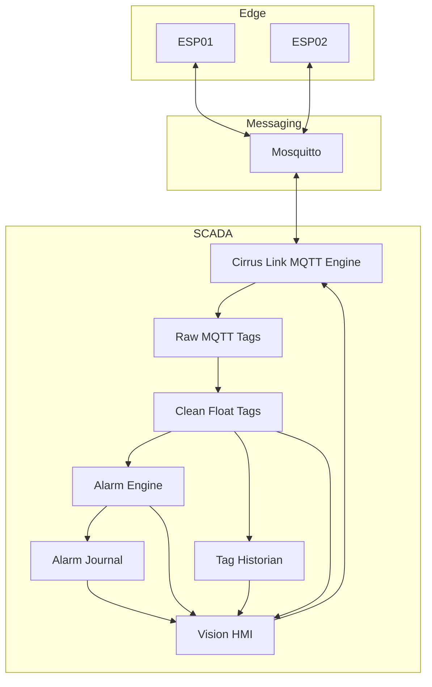

# Architecture

## Overview

The project uses a layered IIoT / SCADA architecture:

1. **Edge layer** — ESP8266 nodes generate temperature telemetry and control an onboard LED.
2. **Messaging layer** — Mosquitto transports telemetry, commands, and state feedback over MQTT.
3. **SCADA ingestion layer** — Cirrus Link MQTT Engine exposes MQTT data to Ignition.
4. **Clean tag layer** — Ignition Expression Tags convert incoming values to Float.
5. **Historian and alarming layer** — temperature history and alarm events are stored for analysis.
6. **HMI layer** — Ignition Vision displays values, trends, alarms, and remote controls.

## Design Decisions

### Separate raw and clean tags

MQTT payloads arrive as text. Clean Expression Tags convert them to Float before historian and alarm processing.

This prevents inconsistent historian storage and separates transport representation from SCADA process values.

### Separate command and feedback topics

The HMI publishes a command topic while the ESP publishes a separate status topic after changing the output.

This is preferable to assuming that a command was executed successfully.

### Least-privilege MQTT ACL

Each ESP can publish only its own telemetry/status and subscribe only to its own command topic. Ignition has read access to telemetry/status and write access to commands.

## Current Scope

The current implementation is a two-node lab prototype with simulated temperature values and SQLite storage.

See `INDUSTRIALIZATION.md` for the changes required before production deployment.
